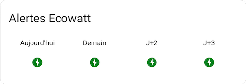
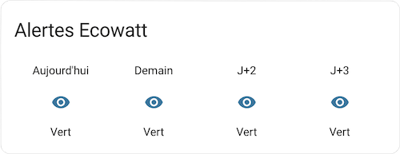

# Ecowatt component for Home Assistant

This component makes the signals provided by RTE ([https://www.monecowatt.fr](https://www.monecowatt.fr)) available in Home Assistant.

Ecowatt is a French service giving a trend about the stress of the electricity network for the next few days.

This integration adds 4 entities in Home Assistant, each indicating the alert level of the day: Green, Orange or Red:



These signals can then be used in your automations to adapt your electricity consumption!

This component uses the [pyecowatt](https://gitlab.com/Darathor/pyecowatt) library.

## Setup

> :warning: This integration is not available via HACS at this time

### Get credentials

You'll need valid `id_client`/`id_secret` tokens from the [RTE Data website](https://data.rte-france.com/web/guest):

- [Create an account on RTE Data website](https://data.rte-france.com/create_account)
- Register to the Ecowatt API and click on "Subscribe to API"
- Create a new app and make sure it's linked to Ecowatt API otherwise it won't work
- Get `client_id` and `client_secret` tokens

### Adding the component

- In your `custom_components` folder, copy the folder `custom_components/ecowatt` folder from this Github repository
- Restart your Home Assistant service

### Setup the integration

- Add a new integration
- Select "ecowatt"
- Enter you `id_client` and `id_secret`
- Validate

## Example of integration in the dashboard

### With the standard `glance` card



```yaml
type: glance
title: Alertes Ecowatt
entities:
  - entity: sensor.ecowatt_day_0
    name: Aujourd'hui
  - entity: sensor.ecowatt_day_1
    name: Demain
  - entity: sensor.ecowatt_day_2
    name: J+2
  - entity: sensor.ecowatt_day_3
    name: J+3
```

### With custom colors based on Alerts

With [`card_mod`](https://github.com/thomasloven/lovelace-card-mod) it's possible to define custom colors based on Ecowatt Alerts:


```yaml
type: glance
name: Alertes Ecowatt
entities:
  - entity: sensor.ecowatt_day_0
    name: Aujourd'hui
    icon: mdi:lightning-bolt-circle
    card_mod:
      style: |
        :host {
          
          
            --paper-item-icon-color: green;
          
            --paper-item-icon-color: orange;
          
            --paper-item-icon-color: red;
          
  - entity: sensor.ecowatt_day_1
    name: Demain
    icon: mdi:lightning-bolt-circle
    card_mod:
      style: |
        :host {
          
          
            --paper-item-icon-color: green;
          
            --paper-item-icon-color: orange;
          
            --paper-item-icon-color: red;
          
  - entity: sensor.ecowatt_day_2
    name: J+2
    icon: mdi:lightning-bolt-circle
    card_mod:
      style: |
        :host {
          
          
            --paper-item-icon-color: green;
          
            --paper-item-icon-color: orange;
          
            --paper-item-icon-color: red;
          
  - entity: sensor.ecowatt_day_3
    name: J+3
    icon: mdi:lightning-bolt-circle
    card_mod:
      style: |
        :host {
          
          
            --paper-item-icon-color: green;
          
            --paper-item-icon-color: orange;
          
            --paper-item-icon-color: red;
          
```
